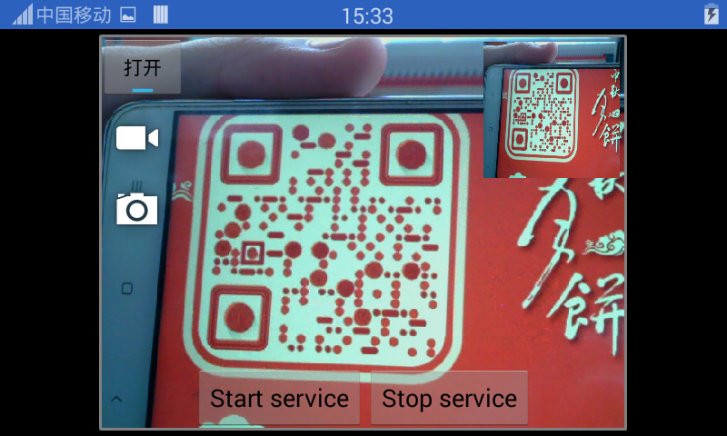
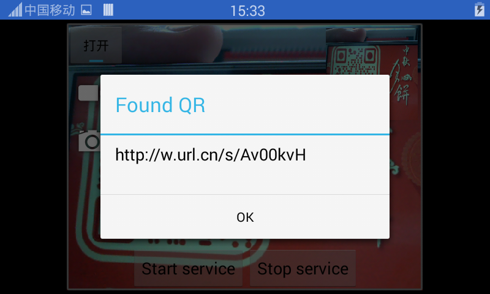
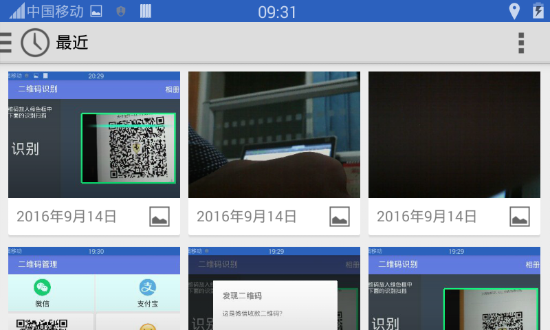

USB 摄像头二维码识别
=========

## 2.40
1. 升级lib库
1. 升级zxing库到3.3.2
1. 生成彩色二维码

usb摄像头识别二维码，涉及安卓技术：

1. TextureView 使用
2. 进程间通信，aidl
3. Service使用
4. 二维码/条码识别,支持选择图片识别
5. USB连接

+ 运行项目，连接USB摄像头，即可自动识别二维码

|扫描二维码|识别结果|选择相册|
|:---:|:---:|:---:|
||||

同样也可识别条码，详细使用请参考我的博客: [USB摄像头预览识别二维码](https://jp1017.github.io/2016/09/15/USB%E6%91%84%E5%83%8F%E5%A4%B4%E9%A2%84%E8%A7%88%E8%AF%86%E5%88%AB%E4%BA%8C%E7%BB%B4%E7%A0%81/)

参考：

+ https://github.com/saki4510t/UVCCamera/tree/master/usbCameraTest4
+ https://github.com/yipianfengye/android-zxingLibrary